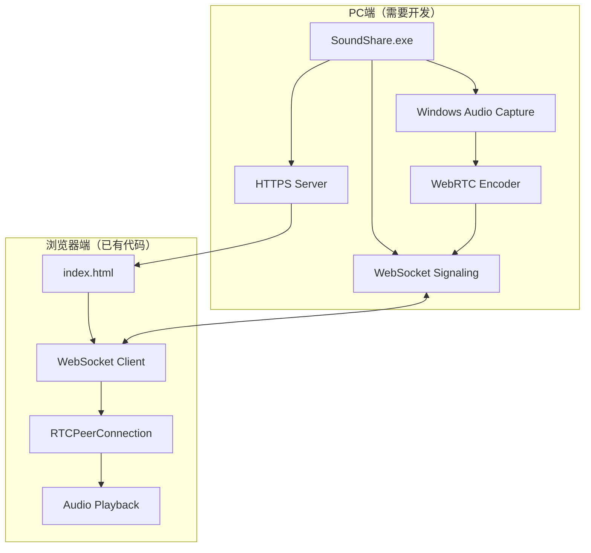
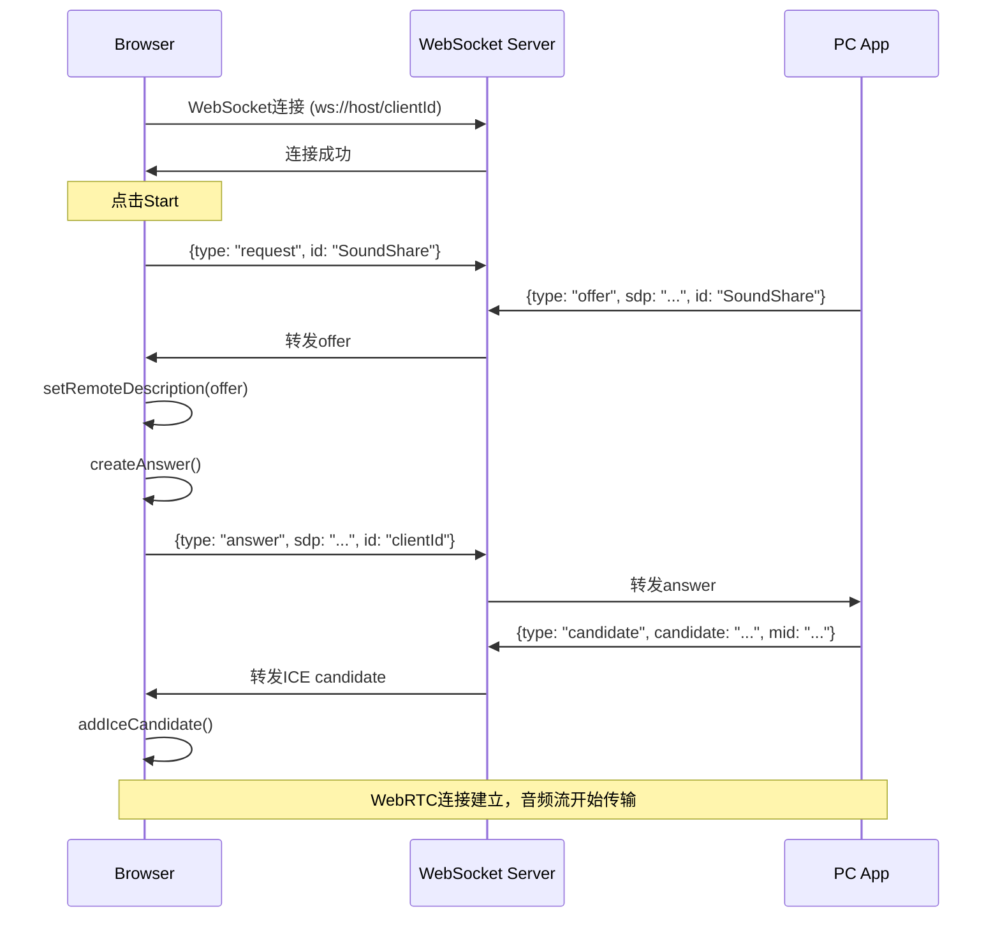

# SoundShare 项目技术上下文

> 本文档用于指导重新实现该项目，包含完整的技术架构、协议细节和代码参考

## 一、项目概述

这是一个基于 **WebRTC** 的实时音频/视频传输系统，实现以下功能：

| 功能 | 方向 | 描述 |
|------|------|------|
| **SoundShare** | PC → 浏览器 | 将PC系统音频传输到浏览器播放 |
| **MicShare** | 浏览器 → PC | 将浏览器麦克风音频传输到PC播放 |
| **ScreenShare** | 浏览器 → PC | 将浏览器屏幕+音频传输到PC播放 |

---

## 二、系统架构



---

## 三、核心技术原理

### 3.1 WebRTC 信令流程



### 3.2 WebSocket 消息协议

```typescript
// 基础消息结构
interface Message {
  id: string;        // 客户端ID或"SoundShare"/"MicShare"
  type: 'offer' | 'answer' | 'candidate' | 'request' | 'key';
}

// SDP消息
interface SDPMessage extends Message {
  type: 'offer' | 'answer';
  sdp: string;       // WebRTC SDP
}

// ICE Candidate消息
interface CandidateMessage extends Message {
  type: 'candidate';
  candidate: string; // ICE candidate字符串
  mid: string;       // Media ID
}

// 请求消息
interface RequestMessage extends Message {
  type: 'request';
}

// 按键消息（音量控制）
interface KeyMessage extends Message {
  type: 'key';
  name: string;      // 'VK_VOLUME_MUTE' | 'VK_VOLUME_DOWN' | 'VK_VOLUME_UP' | etc.
}
```

---

## 四、浏览器端代码实现

### 4.1 SoundShare（接收PC音频）

**核心文件**: `root/SoundShare/sound_share.js`

```javascript
// 关键函数

// 1. 建立WebSocket信令连接
function openSignaling(url) {
  return new Promise((resolve, reject) => {
    const ws = new WebSocket(url)
    ws.onopen = () => resolve(ws)
    ws.onmessage = (e) => {
      const msg = JSON.parse(e.data)
      // 处理offer, candidate消息
    }
  })
}

// 2. 创建RTCPeerConnection（接收端）
function createPeerConnection(ws, id) {
  const config = { bundlePolicy: "max-bundle" }
  const pc = new RTCPeerConnection(config)
  
  // 接收音频轨道
  pc.ontrack = (evt) => {
    if (evt.track.kind !== 'audio') return
    const audio = document.getElementById('audio')
    audio.srcObject = evt.streams[0]
    audio.play()
  }
  return pc
}

// 3. 处理Offer并发送Answer
async function handleOffer(ws, offer) {
  const pc = createPeerConnection(ws, clientId)
  await pc.setRemoteDescription(offer)
  await sendAnswer(ws, pc)
}

// 4. 发送Answer
async function sendAnswer(ws, pc) {
  let answer = await pc.createAnswer()
  // 添加stereo=1支持立体声
  answer.sdp = addStereo(answer.sdp)
  await pc.setLocalDescription(answer)
  await waitGatheringComplete(pc)
  
  ws.send(JSON.stringify({
    id: "SoundShare",
    type: answer.type,
    sdp: answer.sdp
  }))
}

// 5. SDP处理：添加立体声支持
function addStereo(sdp) {
  const start_pos = sdp.indexOf('a=fmtp')
  const end_pos = sdp.indexOf('\r\n', start_pos)
  const line = sdp.substring(start_pos, end_pos)
  if (-1 == line.indexOf('stereo=1')) {
    sdp = sdp.slice(0, end_pos) + ';stereo=1' + sdp.slice(end_pos)
  }
  return sdp
}

// 6. 等待ICE收集完成
async function waitGatheringComplete(pc) {
  return new Promise((resolve) => {
    if (pc.iceGatheringState === 'complete') {
      resolve()
    } else {
      pc.addEventListener('icegatheringstatechange', () => {
        if (pc.iceGatheringState === 'complete') {
          resolve()
        }
      })
    }
  })
}
```

### 4.2 MicShare（发送麦克风到PC）

**核心文件**: `root/MicShare/mic_share.js`

```javascript
// 关键差异：发送端逻辑

async function start() {
  // 1. 获取麦克风权限
  const constraints = {
    audio: {
      echoCancellation: true,
      noiseSuppression: true,
      autoGainControl: true
    },
    video: false
  }
  const stream = await navigator.mediaDevices.getUserMedia(constraints)
  
  // 2. 建立WebSocket连接
  const ws = await openSignaling('wss://' + server + '/' + clientId)
  
  // 3. 创建Offer并发送
  sendOffer(ws, 'MicShare', stream)
}

function sendOffer(ws, id, stream) {
  const pc = createPeerConnection(ws, id)
  
  // 添加音频轨道（发送端）
  stream.getTracks().forEach(track => {
    const transceiver = pc.addTransceiver(track, {
      direction: 'sendonly',
      streams: [stream]
    })
  })
  
  // 创建Offer
  pc.createOffer({ iceRestart: false })
    .then((offer) => {
      // SDP处理
      offer.sdp = addStereo(removeRtpmap(offer.sdp))
      return pc.setLocalDescription(offer)
    })
    .then(() => {
      ws.send(JSON.stringify({
        id, 
        type: 'offer', 
        sdp: pc.localDescription.sdp
      }))
    })
}

// 移除不需要的rtpmap（只保留Opus）
function removeRtpmap(sdp) {
  const lines = sdp.split('\r\n')
  return lines.filter(line => {
    if (line.startsWith('a=rtpmap:')) {
      return line.startsWith('a=rtpmap:109 ') || line.startsWith('a=rtpmap:111 ')
    }
    if (line.startsWith('a=rtcp-fb:')) {
      return line.startsWith('a=rtcp-fb:109 ') || line.startsWith('a=rtcp-fb:111 ')
    }
    if (line.startsWith('a=fmtp:')) {
      return line.startsWith('a=fmtp:109 ') || line.startsWith('a=fmtp:111 ')
    }
    return true
  }).join('\r\n')
}
```

---

## 五、PC端需要实现的功能

### 5.1 核心组件

```
┌─────────────────────────────────────────────────────────┐
│                    PC端程序架构                          │
├─────────────────────────────────────────────────────────┤
│  ┌─────────────┐  ┌─────────────┐  ┌─────────────┐     │
│  │ HTTPS Server│  │ WebSocket   │  │ WebRTC      │     │
│  │ (静态文件)   │  │ Signaling   │  │ Endpoint    │     │
│  └──────┬──────┘  └──────┬──────┘  └──────┬──────┘     │
│         │                │                │             │
│         └────────────────┼────────────────┘             │
│                          │                              │
│  ┌───────────────────────┴───────────────────────┐     │
│  │              Signaling Server                  │     │
│  │  - 管理客户端连接                               │     │
│  │  - 转发SDP/ICE消息                             │     │
│  │  - 路由消息到正确的客户端                        │     │
│  └───────────────────────────────────────────────┘     │
│                          │                              │
│  ┌───────────────────────┴───────────────────────┐     │
│  │           Audio Capture (Windows)              │     │
│  │  - WASAPI Loopback 捕获系统音频                 │     │
│  │  - 音频编码（Opus）                             │     │
│  │  - 通过WebRTC发送                               │     │
│  └───────────────────────────────────────────────┘     │
└─────────────────────────────────────────────────────────┘
```

### 5.2 技术选型建议

| 组件 | 推荐技术 | 说明 |
|------|---------|------|
| **编程语言** | Go / Rust / C# | Go最适合，跨平台、内置HTTP服务器 |
| **音频捕获** | WASAPI Loopback | Windows Audio Session API |
| **WebRTC** | pion/webrtc (Go) / aiortc (Python) | pion是最成熟的Go WebRTC库 |
| **HTTPS** | 自签名证书 | 需要HTTPS才能使用WebRTC |
| **WebSocket** | gorilla/websocket | Go标准WebSocket库 |

### 5.3 PC端核心逻辑伪代码（Go示例）

```go
// Go伪代码示例

package main

import (
    "github.com/pion/webrtc/v3"
    "golang.org/x/sys/windows"
)

// 1. 启动HTTPS服务器
func startHTTPSServer() {
    // 提供静态文件
    http.Handle("/", http.FileServer(http.Dir("root")))
    
    // WebSocket信令端点
    http.HandleFunc("/ws", handleWebSocket)
    
    // 启动HTTPS
    http.ListenAndServeTLS(":8443", "cert.pem", "key.pem", nil)
}

// 2. WebSocket信令处理
func handleWebSocket(w http.ResponseWriter, r *http.Request) {
    conn, _ := upgrader.Upgrade(w, r, nil)
    clientId := extractClientId(r.URL.Path)
    
    // 注册客户端
    clients[clientId] = conn
    
    for {
        _, msg, _ := conn.ReadMessage()
        var signal SignalMessage
        json.Unmarshal(msg, &signal)
        
        switch signal.Type {
        case "request":
            // 客户端请求音频，启动WebRTC连接
            go startWebRTCStream(conn, signal.Id)
        case "answer":
            // 处理WebRTC Answer
            handleAnswer(signal)
        case "candidate":
            // 处理ICE Candidate
            handleCandidate(signal)
        }
    }
}

// 3. WebRTC音频流
func startWebRTCStream(ws *websocket.Conn, targetId string) {
    // 创建PeerConnection
    pc, _ := webrtc.NewPeerConnection(webrtc.Configuration{
        BundlePolicy: webrtc.BundlePolicyMaxBundle,
    })
    
    // 收集ICE Candidate并发送给客户端
    pc.OnICECandidate(func(c *webrtc.ICECandidate) {
        if c != nil {
            sendCandidate(ws, targetId, c)
        }
    })
    
    // 捕获系统音频（WASAPI Loopback）
    audioTrack := captureSystemAudio()
    pc.AddTrack(audioTrack)
    
    // 创建Offer
    offer, _ := pc.CreateOffer(nil)
    pc.SetLocalDescription(offer)
    
    // 发送Offer给客户端
    sendOffer(ws, targetId, offer)
}

// 4. WASAPI Loopback音频捕获（核心）
func captureSystemAudio() *webrtc.TrackLocalStaticSample {
    // 使用Windows WASAPI Loopback捕获系统音频
    // 这是最关键的部分！
    
    // 初始化WASAPI
    // 设置Loopback模式（捕获系统输出）
    // 创建音频轨道
    // 返回WebRTC Track
}
```

### 5.4 Windows音频捕获关键代码

```go
// 使用oto库或直接调用WASAPI

/*
关键步骤：
1. 枚举音频输出设备
2. 使用AUDCLNT_STREAMFLAGS_LOOPBACK标志
3. 捕获所有系统音频（包括浏览器、播放器等）
4. 转换为WebRTC支持的格式（Opus编码）
*/

// 推荐库：
// - github.com/pion/webrtc/v3
// - github.com/pion/mediadevices (支持音频捕获)
// - github.com/gordonklaus/portaudio (跨平台音频)
```

---

## 六、完整文件清单

### 6.1 浏览器端文件

```
root/
├── SoundShare/
│   ├── index.html          # 入口页面
│   ├── sound_share.js      # 核心逻辑（接收PC音频）
│   └── sound_share.css     # 样式
├── MicShare/
│   ├── index.html          # MicShare入口
│   ├── mic_share.js        # 发送麦克风到PC
│   ├── mic_share.css       # 样式
│   ├── player.html         # PC端播放器页面
│   ├── mic_share_player.js # 播放器逻辑
│   ├── screen_share.html   # 屏幕共享入口
│   ├── screen_share.js     # 屏幕共享逻辑
│   ├── screen_view.html    # 屏幕查看页面
│   ├── screen_view.js      # 屏幕查看逻辑
│   └── screen_view.css     # 屏幕查看样式
```

### 6.2 配置文件

```
conf/
├── cert.pem                # HTTPS证书
├── key.pem                 # HTTPS私钥
├── WebView2_en-US.toml     # 英文UI配置
└── WebView2_zh-CN.toml     # 中文UI配置
```

---

## 七、关键技术细节

### 7.1 SDP处理技巧

```javascript
// 1. 添加立体声支持
function addStereo(sdp) {
  // 在a=fmtp行添加stereo=1
  // Opus编码器默认是单声道，需要显式启用立体声
}

// 2. 移除不需要的编码器
function removeRtpmap(sdp) {
  // 只保留Opus (rtpmap:109, rtpmap:111)
  // 移除其他音频编码器
}
```

### 7.2 音频声道处理

```javascript
// Stereo模式：直接播放
audio.srcObject = evt.streams[0]

// Mono模式：提取单个声道
const audioContext = new AudioContext()
const source = audioContext.createMediaStreamSource(evt.streams[0])
const splitter = audioContext.createChannelSplitter(2)
source.connect(splitter)

const destination = audioContext.createMediaStreamDestination()
splitter.connect(destination, 0)  // 左声道
// 或 splitter.connect(destination, 1)  // 右声道

audio.srcObject = destination.stream
```

### 7.3 自签名证书问题

- 浏览器会显示证书警告
- 需要用户手动信任证书
- 指纹：`ff8a8160116e35775506d0dd86360935877aaf3b`

---

## 八、实现路线图

### Phase 1: 基础框架
1. [ ] HTTPS服务器（自签名证书）
2. [ ] WebSocket信令服务器
3. [ ] 静态文件服务
4. [ ] 客户端连接管理

### Phase 2: WebRTC集成
1. [ ] 集成WebRTC库（pion/webrtc）
2. [ ] 实现Offer/Answer交换
3. [ ] ICE Candidate处理
4. [ ] SDP消息路由

### Phase 3: 音频捕获（核心）
1. [ ] **WASAPI Loopback音频捕获**
2. [ ] 音频格式转换
3. [ ] Opus编码
4. [ ] WebRTC Track创建

### Phase 4: 完善
1. [ ] 多客户端支持
2. [ ] 音量控制（VK_VOLUME_*）
3. [ ] 错误处理
4. [ ] UI优化

---

## 九、关键难点

### 9.1 Windows系统音频捕获（最核心）

这是整个项目最关键的技术难点。需要使用 **WASAPI Loopback** 模式：

```cpp
// C++ WASAPI Loopback 示例
HRESULT CreateLoopbackCapture(IAudioClient** ppAudioClient) {
    // 1. 获取默认输出设备
    IMMDeviceEnumerator* pEnumerator;
    pEnumerator->GetDefaultAudioEndpoint(eRender, eConsole, &pDevice);
    
    // 2. 激活AudioClient
    IAudioClient* pAudioClient;
    pDevice->Activate(__uuidof(IAudioClient), CLSCTX_ALL, NULL, &pAudioClient);
    
    // 3. 设置Loopback模式（关键！）
    AUDCLNT_STREAMFLAGS_LOOPBACK  // 这个标志实现系统音频捕获
    pAudioClient->Initialize(
        AUDCLNT_SHAREMODE_SHARED,
        AUDCLNT_STREAMFLAGS_LOOPBACK,  // Loopback模式
        hnsRequestedDuration,
        0,
        pFormat,
        NULL
    );
}
```

### 9.2 Go实现推荐

```go
// 使用现成的库
import (
    "github.com/pion/webrtc/v3"
    "github.com/pion/mediadevices"
    "github.com/pion/mediadevices/pkg/codec/openh264"
    _ "github.com/pion/mediadevices/pkg/driver/audiosense" // 音频捕获
)

// 或者直接调用Windows API
// github.com/go-ole/go-ole + 自定义WASAPI绑定
```

---

## 十、快速启动指南

### 最简实现（Python原型）

如果只想快速验证，可以用Python：

```python
# requirements.txt
# aiortc==1.6.0
# websockets
# pyaudio

import asyncio
import json
from aiortc import RTCPeerConnection, RTCSessionDescription
from aiortc.contrib.media import MediaPlayer
import websockets

# 捕获系统音频（Windows）
# 需要安装VB-Cable虚拟音频设备
player = MediaPlayer('audio=virtual_device', format='dshow')

async def signaling(websocket, path):
    pc = RTCPeerConnection()
    pc.addTrack(player.audio)
    
    async for message in websocket:
        data = json.loads(message)
        
        if data['type'] == 'request':
            offer = await pc.createOffer()
            await pc.setLocalDescription(offer)
            await websocket.send(json.dumps({
                'type': 'offer',
                'sdp': pc.localDescription.sdp
            }))
        
        elif data['type'] == 'answer':
            await pc.setRemoteDescription(
                RTCSessionDescription(data['sdp'], 'answer')
            )

# 启动服务器
start_server = websockets.serve(signaling, "localhost", 8443)
asyncio.get_event_loop().run_until_complete(start_server)
```

---

## 十一、参考资源

1. **WebRTC标准**: https://webrtc.org/
2. **Pion WebRTC (Go)**: https://github.com/pion/webrtc
3. **WASAPI文档**: https://docs.microsoft.com/en-us/windows/win32/coreaudio/wasapi
4. **WebRTC Samples**: https://webrtc.github.io/samples/
5. **原项目**: https://github.com/RegameDesk/sound_share

---

## 十二、总结

这个项目的核心技术是 **WebRTC + WebSocket信令 + WASAPI Loopback音频捕获**。

浏览器端代码已完整可用，您只需要实现PC端的：
1. HTTPS+WebSocket服务器
2. WebRTC Offer/Answer处理
3. **Windows系统音频捕获**（最核心）

**最关键的技术点**是使用WASAPI Loopback模式捕获Windows系统音频，这是整个项目能够"无需安装驱动"的核心原因。
